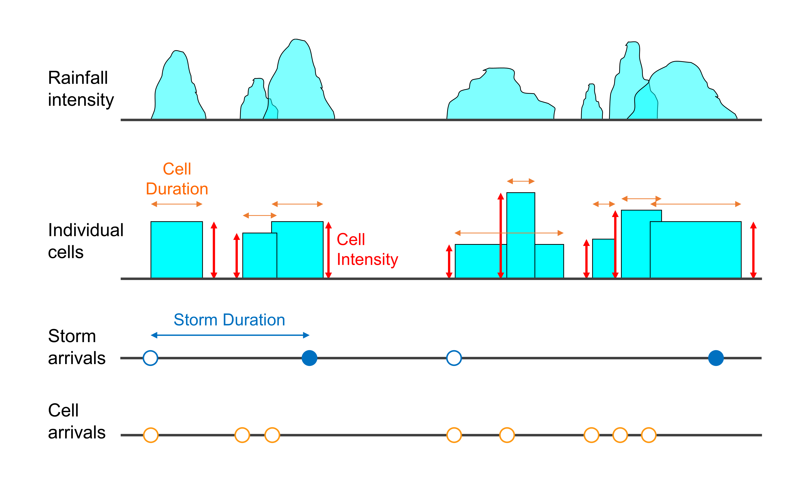
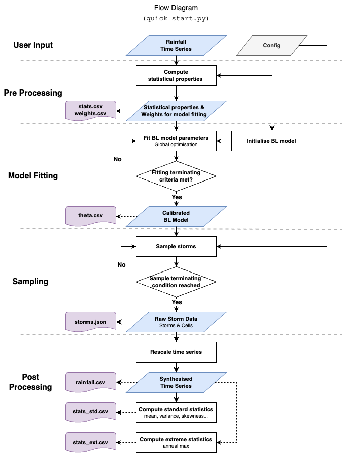

<!-- <h1 align="center">
  <br>
  <a href="https://example.com/">
  </a>
  <br>
  pyBL
  <br>
</h1> -->

<h2 align="center">pyBL: An open-source Python package for stochastic modeling of rainfall using the Bartlett-Lewis Rectangular Pulse model.</h2>

<p align="center">
  <a href="http://makeapullrequest.com">
    
  </a>
  <a href="#">
    
  </a>
</p>

<p align="center">
  <a href="#key-features">Key Features</a> •
  <a href="#model-description">Model Description</a> •
  <a href="#workflow-of-pybl">Workflow of pyBL</a> •
  <a href="#installation-guide">Installation Guide</a> •
  <a href="#usage">Usage</a> •
  <!-- <a href="#community">Community</a> • -->
  <!-- <a href="#acknowledgements">Acknowledgements</a> • -->
  <!-- <a href="#license">License</a> -->
  <a href="#references">References</a>
</p>

## Key Features
- **Realistic rainfall Modelling**: Simulations of rainfall time series with realistic feaytures using the Bartlett-Lewis Rectangular Pulse model.
- **Efficient Sampling**: Our innovative data structure enables the generation of a 100-year long time series within less than a second.
- **High Resolution**: Our model can simulate rainfall time series that preserves both standard and extreme statistcis at fine time scales, down to 1-minute intervals.
- **Wide Range Applications**: Suitable for hydrological modeling, design storm analysis, flood simulation, and climate risk studies.
- **Open Source**: Encourages contributions and customisation from the community.

## Model Description
The Bartlett-Lewis Rectangular Pulses model, enhanced in this package, draws on the cutting-edge research presented in Onof and Wang (2020). It operates as a robust stochastic framework designed to simulate rainfall intensity effectively. By modelling the behavior of rainfall through a Poisson cluster point process, the package accounts for individual characteristics of rain cells and storm patterns, including cell duration, intensity, and overall storm duration. Enhanced by the latest scientific advances, this model offers improved accuracy in predicting and simulating the stochastic nature of rainfall events.




## Workflow of pyBL

<!-- //CY: previous version -->
<!-- The pyBL package follows a systematic workflow for generating synthetic rainfall time series using historical records. The process involves computing statistical properties, fitting BL model parameters, sampling storms, and rescaling time series to produce synthesized time series. -->

The pyBL package employs a systematic workflow to generate synthetic rainfall time series from historical data. The process involves:

- Statistical analysis of historical data.
- Fitting the Bartlett-Lewis model parameters.
- Sampling storms and generating synthetic rainfall time series.
- Rescaling and validating the synthesized time series.

<!-- //CY: the necessarity of adding this line? -->
<!-- For a detailed breakdown of each step, see our Detailed Workflow Documentation. -->




## Installation Guide

To install the pyBL package, follow these steps:

1. **Clone the project:**

   ```sh
   git clone https://github.com/NTU-CompHydroMet-Lab/pyBL.git
   cd pyBL
   ```
2. **Install dependencies:**

   ```sh
   pip install -r requirements.txt
   ```

## Usage

Here's a simple example of how to use the pyBL package:


1. **Start quickly**: Begin with `quick_start.py`, which demonstrates the end-to-end process using historical rainfall data from Bochum, Germany.
<!-- 
2. **Some simple examples**

```python
import pybl

# Example usage
# [[need help from kilin]]

``` -->
<!-- ## Contribution  -->

<!-- ## Citation -->


## References
-  Onof, C. and Wang, L.-P. (2020). Modelling rainfall with a Bartlett-Lewis process: new developments. Hydrology and Earth System Sciences. 24. 2791-2815. doi:10.5194/hess-24-2791-2020. 
